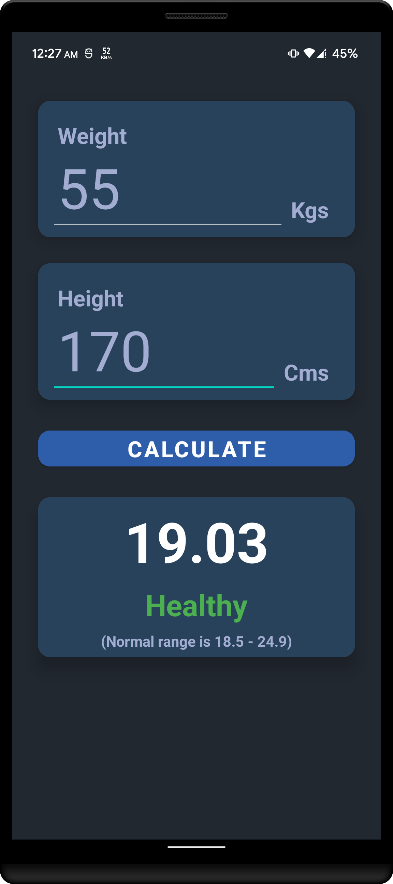
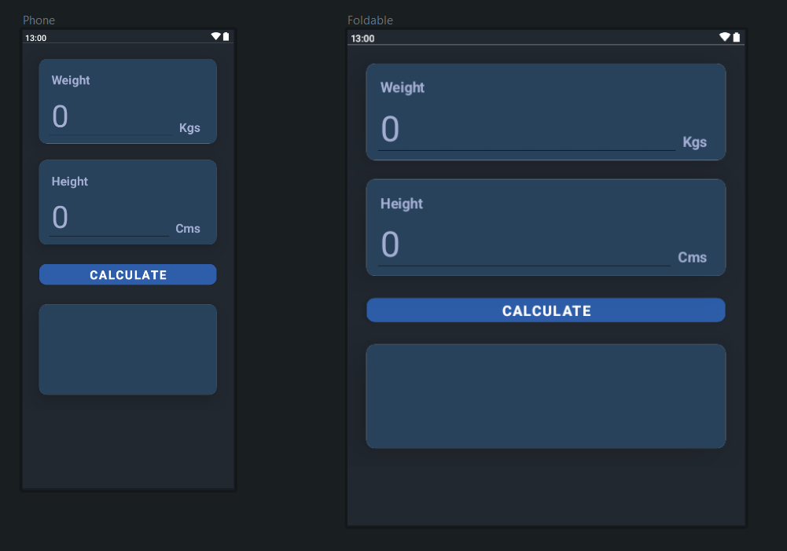
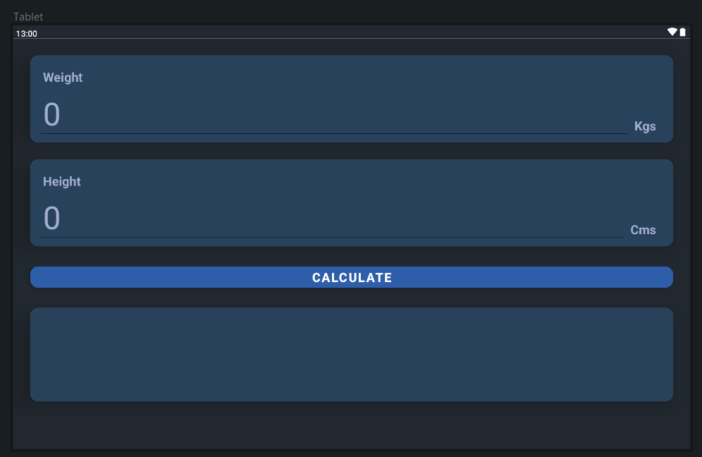

# BMICalculator 💪🏻
> [Body mass index (BMI)](https://en.wikipedia.org/wiki/Body_mass_index) is a value derived from the mass (weight) and height of a person. The BMI is defined as the body mass divided by the square of the body height, and is expressed in units of kg/m2, resulting from mass in kilograms and height in metres.    
> The BMI is a convenient rule of thumb used to broadly categorize a person as underweight, normal weight, overweight, or obese based on tissue mass (muscle, fat, and bone) and height.

- An android app written in Kotlin 💜 to calculate BMI Score. ✨
- If you like it, please star the repo. 🌟
- Live Screenshot 🔥    
  

- Attempt to make it Responsive, 🔎

  

    
Phone and Foldable device 📱

  
    
  

  

    
Tablet 💻 

  
    
  

- For bugs/feedback please [create](https://github.com/SandeepUrankar/BMICalculator/issues/new) issues. 🪲🐛
